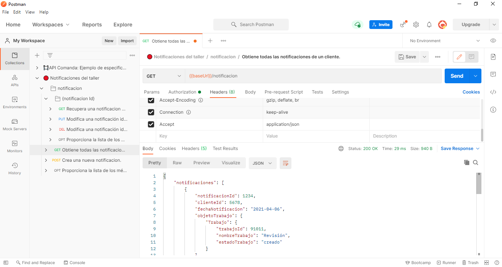

# Subsistema 4. Gestión de notificaciones 🔔
Envío de **notificaciones** relacionadas con el funcionamiento del taller. 
Este subsistema es el encargado de notificar a los clientes el estado de los diferentes trabajos.

## 📋 Descripción del servicio de notificaciones

### Implementación
Hemos empleado la herramienta [swagger-codegen](https://github.com/swagger-api/swagger-codegen) para implementar nuestra API. En concreto usando el framework Spring Boot.

Hemos utilizado la imagen de mysql de Docker Hub como tecnología de persistencia de datos para nuestro servicio.

### Imagen Docker Hub

- [Link](https://hub.docker.com/repository/docker/jvidalc/aos_subsistema4_notificaciones)
- Imagen: `jvidalc/aos_subsistema4_notificaciones:latest`

>***NOTA***: 
>- `Debido a problemas de integración de la base de datos de nuestro servicio para el resto de grupos, hemos creado una versión de la imagen con un mock para las peticiones de la API` 


### Endpoints de la API de notificaciones

- /AOS4/notificacion
  - GET: Devuelve en un array todas las notificaciones de un cliente
  - POST: Crea una notificación especificando las propiedades requeridas.
  - OPTIONS: Proporciona la lista de los métodos HTTP soportados.

- /AOS4/notificacion/{notificacionId}
  - GET: Recupera una notificación específica identificada por su ID.
  - PUT: Modifica una notificación específica identificada por su ID.
  - DELETE: Elimina una notificación específica identificada por su ID.
  - OPTIONS: Proporciona la lista de los métodos HTTP soportados.


## ⚙️ Despliegue de todos los servicios del taller

### docker-compose

Para desplegar el servicio con docker-compose hemos considerado las siguientes decisiones de diseño:
- Un contenedor por imagen de servicio, cada uno con puerto externo diferente asignado.
- Hemos creado una network común a todos los serivicios: `network: taller`
- Un contenedor con la imagen de mysql:8 para la persistencia de datos
- Una `network: ss4-mysql` para conectar nuestro servicio de notificaciones con el contenedor de persitencia de datos mysql.
  
Para ejecutar el servicio se deberá hacer uso del archivo `docker-compose.yml` disponible en el repositorio. A continuación se procederá a ejecutar el siguiente comando sobre su directorio:
```
docker-compose up -d
```

### kubernetes

Hemos empleado la herramienta [minikube](https://minikube.sigs.k8s.io/docs/start/) para el despliegue de los serivicios del taller.

Para desplegar el servicio con kubernetes hemos considerado las siguientes decisiones de diseño:
- Hemos creado un **deployment** por cada servicio del taller, asignando un puerto de acceso de pod distinto a cada uno para evitar posibles conflictos.
- Un **servicio** por cada deployment. Teniendo en cuenta que necesitábamos acceder a los puertos de cada uno de los servicios para probarlos, consideremos que los puertos sean tipo ´NodePort´, a pesar de que no sea la opción más optima para un servicio backend de una API rest.
- También creamos un `PersistentVolumeClaim` para dotar de persistencia al despliegue de la persistencia de datos en mysql.

De cara a la implementación del servicio en un cluster de kubernetes se puede usar la template `kubernetes-deployment.yml`.
```
kubectl apply -f kubernetes-deployment.yml
```

### Despliegue en nube pública

- Despliegue en Amazon Web Services usando Elastic Kubernetes Services. Hemos decidido desplegar la aplicación en la nube publica de Amazon. 



- Hemos intentado el despliegue de la aplicación con cada uno de los servicios en la nube, pero a pesar de disponer el crédito necesario, el portal de azure no nos ha permitido desplegarlo sin introducir un método de pago. 


### PostMan 

- Hemos usado Postman para probar las peticiones a la api del servicio.

